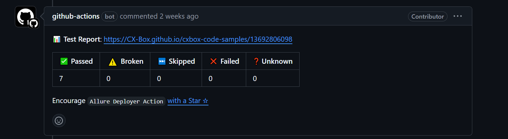
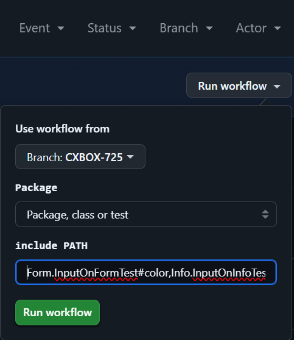
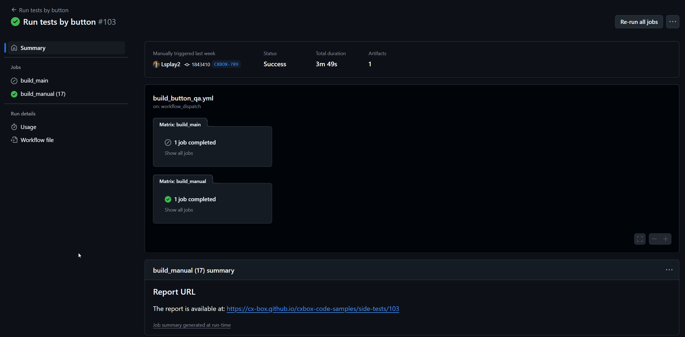

# code-samples UI-tests


## Ways to run tests:
### Local

* To run tests on the website
```
Add the url of the default page to the env in cmd (for Windows)
  setx APP_URL http://code-samples.cxbox.org/ui/#/
```
```
Run the tests using mvn

To run a specific test: 
mvn -DrunTests=true -Dtest=application.Samples.{testPacage}.{testClass}#{test} test   

To run all the tests from the class:  
mvn -DrunTests=true -Dtest=application.Samples.{testPacage}.{testClass} test

To run all the tests classes from the package:
mvn -DrunTests=true -Dtest=application.Samples.{testPacage}.** test

You can combine tests:
mvn -DrunTests=true -Dtest=application.Samples.{testPacage}.**,application.Samples.{anotherTestPacage}.{testClass} test
```

* To run tests on the local build
1. Set env
```
Add the url of the default page to the env in cmd (for Windows)
  setx APP_URL http://localhost:81/ui/#/
```
2. Open Docker desktop
3. Build project 
```
mvn clean install -PUI
```
4. Launch [docker-compose-test.yml](docker-compose-test.yml)
5. When docker starts, you will be able to run tests as on the website.

### GitHub Actions

* Launch at pull request
1. When you try to make a pull request in main, the tests will run on your build and the result will be visible in allure attached to the pr. Example:

2. You can view the details in the allure report by following the link in the Test Report.


* Launch by button
1. To start using the button, go to

https://github.com/CX-Box/cxbox-code-samples/actions/workflows/build_button_qa.yml
2. Using "Run  workflow". 



```
1. Select branch 
2. Choose whether to check all tests (All tests), or just some (Package, class or test)
3. If you are running only some tests, specify the path to the tests. Use {testPackage}.{testClass}#{test} 
    Example(Form.InputOnFormTest#color,Info.InputOnInfoTest).
    This example will output result of color test in Form.InputOnFormTest and all tests in Info.InputOnInfoTest
4. Click to Run workflow button
5. Switch to the running workflow. 
    When it is completed, you can view the Allure report via the link inside workflow.
```


```
Warning:
When you launch ALL test at MAIN branch by button, results will save in project history. 
Otherwise, there will be a unique allure report.
```

## Environment variables
* APP_URL - the url where the tests will be run (default - http://code-samples.cxbox.org/ui/#/)
* CXBOX_RECORDER - true/false indicates whether video will be recorded for dropped tests.
